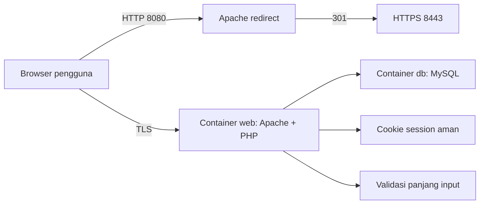

# Dokumentasi Aplikasi CLO 2 Secure Comments

## 1. Pendahuluan

Secure Comments adalah aplikasi papan komentar publik untuk demonstrasi pengamanan aplikasi web target 80 poin. Aplikasi dibuat dengan PHP, Apache, MySQL, dan Docker Compose. Pengguna publik dapat membaca komentar, pengguna terdaftar dapat menulis komentar, dan admin dapat melihat monitoring tabel `users` dan `comments`.

Scope penilaian yang ditunjukkan:

- SSL/TLS pada web server.
- Password disimpan memakai hash dan salt.
- Pembatasan input untuk mengurangi risiko buffer overflow/input berlebihan.

## 2. Arsitektur dan Instalasi

Komponen utama:

- `web`: container PHP 8.3 + Apache dengan SSL aktif.
- `db`: container MySQL 8.4.
- Network Docker: `192.168.240.0/24`.
- IP container web: `192.168.240.10`.
- IP container database: `192.168.240.11`.

Catatan ketentuan Nama+NIM: konfigurasi saat ini memakai nama container generik sesuai README. Jika dosen mewajibkan Nama+NIM dan oktet akhir IP dari 3 digit NIM, ubah `container_name` dan subnet/IP pada `docker-compose.yml` sebelum dikumpulkan.

Cara menjalankan:

```powershell
docker compose up --build -d
```

Jika Docker Desktop belum aktif:

```powershell
.\scripts\start-site.ps1
```

URL demo:

- HTTPS: `https://localhost:8443`
- HTTP redirect: `http://localhost:8080`

Browser akan menampilkan peringatan karena sertifikat dibuat sendiri untuk demo lokal.

## 3. Blok Diagram



## 4. Fitur Aplikasi

- Halaman utama `/` menampilkan komentar publik.
- `/signup.php` untuk pendaftaran user biasa.
- `/login.php` untuk autentikasi.
- `/comment.php` untuk menulis komentar setelah login.
- `/admin.php` hanya untuk role admin dan menampilkan hash password.
- `/logout.php` untuk keluar dari sesi.

Akun demo:

- Username: `admin`
- Password: `Admin@240!`

## 5. Metode Pengamanan

### SSL/TLS

Apache dikonfigurasi dengan SSL pada port 443 container, dipetakan ke `https://localhost:8443`. Sertifikat self-signed dibuat saat build image dengan OpenSSL:

- Algoritma kunci publik: RSA.
- Panjang kunci: 2048 bit.
- Masa berlaku: 365 hari.

HTTP pada `localhost:8080` diarahkan ke HTTPS.

### Hash dan Salt Password

Password tidak disimpan dalam plaintext. PHP memakai:

```php
password_hash($password, PASSWORD_DEFAULT)
password_verify($password, $hash)
```

`password_hash()` otomatis membuat salt unik untuk setiap password. Pada PHP 8.3, `PASSWORD_DEFAULT` memakai bcrypt. Format hash admin contoh:

```text
$2y$10$t4W41OrdYPbD04t2DXUyYeaSU24Je8.AK1Rd5HJZWQahO.qnrmdIG
```

Keterangan:

- `$2y$` menunjukkan bcrypt.
- `10` adalah cost.
- Salt bcrypt ada pada 22 karakter setelah prefix `$2y$10$`, misalnya `t4W41OrdYPbD04t2DXUyYe`.

### Buffer Overflow / Input Abuse

Aplikasi web PHP tidak memakai buffer manual seperti C, tetapi risiko input berlebihan dikurangi dengan:

- `LimitRequestBody` pada Apache.
- Validasi panjang username 3-32 karakter.
- Validasi password maksimal 128 karakter.
- Validasi komentar maksimal 500 karakter di sisi server dan client.
- Pattern username hanya huruf, angka, dan underscore.

Jika komentar lebih dari 500 karakter dikirim, server menolak input tersebut dan tidak menyimpannya ke database.

## 6. Skenario Uji

| No | Skenario | Hasil yang diharapkan |
| --- | --- | --- |
| 1 | Buka `/` tanpa login | Komentar publik tampil |
| 2 | Buka `/comment.php` tanpa login | Diarahkan ke login |
| 3 | Signup user baru | User bisa dibuat dan login |
| 4 | User biasa buka `/admin.php` | Ditolak dengan HTTP 403 |
| 5 | Admin buka `/admin.php` | Tabel users/comments dan hash password tampil |
| 6 | Inspeksi sertifikat HTTPS | Public key RSA 2048-bit terlihat |
| 7 | Cek hash admin di panel admin | Hash bcrypt bersalt tampil, bukan plaintext |
| 8 | Komentar lebih dari 500 karakter | Ditolak |

## 7. Kesimpulan

Aplikasi memenuhi scope target 80 poin: transport dienkripsi dengan HTTPS, password diamankan memakai hash dan salt, serta input komentar dibatasi untuk mengurangi risiko buffer overflow/input berlebihan.

## 8. Catatan Penggunaan AI

Bantuan AI digunakan untuk menyusun dan mengimplementasikan aplikasi, dokumentasi, naskah video, dan presentasi berdasarkan instruksi tugas serta README. Jika aturan kelas membatasi AI hanya untuk editing, mahasiswa perlu menyesuaikan dokumen akhir dengan versi asli/manual yang dimiliki dan melampirkan versi asli sebelum diedit AI.
