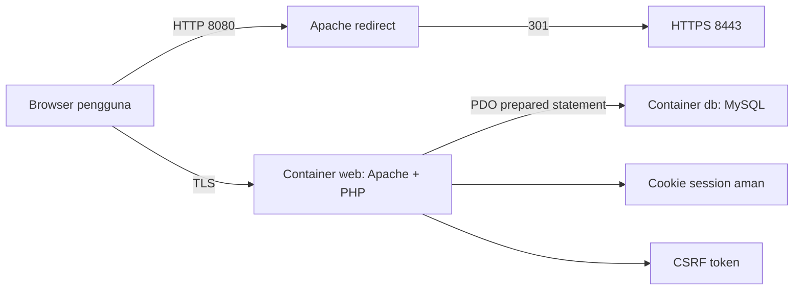

# Dokumentasi Aplikasi CLO 2 Secure Comments

## 1. Pendahuluan

Secure Comments adalah aplikasi papan komentar publik untuk demonstrasi pengamanan aplikasi web. Aplikasi dibuat dengan PHP, Apache, MySQL, dan Docker Compose. Pengguna publik dapat membaca komentar, pengguna terdaftar dapat menulis komentar, dan admin dapat melihat monitoring tabel `users` dan `comments`.

Tujuan keamanan yang ditunjukkan:

- SSL/TLS pada web server.
- Password disimpan memakai hash dan salt.
- Proteksi SQL injection.
- Pembatasan input untuk mengurangi risiko buffer overflow/abuse.
- Mitigasi XSS scripting.
- Mitigasi brute force sederhana.

## 2. Arsitektur dan Instalasi

Komponen utama:

- `web`: container PHP 8.3 + Apache dengan SSL aktif.
- `db`: container MySQL 8.4.
- Network Docker: `192.168.240.0/24`.
- IP container web: `192.168.240.10`.
- IP container database: `192.168.240.11`.

Catatan ketentuan Nama+NIM: konfigurasi saat ini memakai nama container generik sesuai README. Jika dosen mewajibkan Nama+NIM dan oktet akhir IP dari 3 digit NIM, ubah `container_name` dan subnet/IP pada `docker-compose.yml` sebelum dikumpulkan.

Cara menjalankan:

```powershell
docker compose up --build -d
```

Jika Docker Desktop belum aktif:

```powershell
.\scripts\start-site.ps1
```

URL demo:

- HTTPS: `https://localhost:8443`
- HTTP redirect: `http://localhost:8080`

Browser akan menampilkan peringatan karena sertifikat dibuat sendiri untuk demo lokal.

## 3. Blok Diagram



## 4. Fitur Aplikasi

- Halaman utama `/` menampilkan komentar publik.
- `/signup.php` untuk pendaftaran user biasa.
- `/login.php` untuk autentikasi.
- `/comment.php` untuk menulis komentar setelah login.
- `/admin.php` hanya untuk role admin.
- `/logout.php` untuk keluar dari sesi.

Akun demo:

- Username: `admin`
- Password: `Admin@240!`

## 5. Metode Pengamanan

### SSL/TLS

Apache dikonfigurasi dengan SSL pada port 443 container, dipetakan ke `https://localhost:8443`. Sertifikat self-signed dibuat saat build image dengan OpenSSL:

- Algoritma kunci publik: RSA.
- Panjang kunci: 2048 bit.
- Masa berlaku: 365 hari.

HTTP pada `localhost:8080` diarahkan ke HTTPS.

### Hash dan Salt Password

Password tidak disimpan dalam plaintext. PHP memakai:

```php
password_hash($password, PASSWORD_DEFAULT)
password_verify($password, $hash)
```

`password_hash()` otomatis membuat salt unik untuk setiap password. Pada PHP 8.3, `PASSWORD_DEFAULT` memakai bcrypt kecuali default PHP berubah di versi mendatang.

### SQL Injection

Mode aman memakai prepared statement PDO:

```php
$stmt = $pdo->prepare('SELECT id, username, password_hash, role FROM users WHERE username = ? LIMIT 1');
$stmt->execute([$username]);
```

Payload seperti `' OR '1'='1` tidak dapat mengubah struktur query pada mode secure.

Untuk demonstrasi, mode raw query bisa dijalankan dengan:

```powershell
docker compose -f docker-compose.yml -f docker-compose.vulnerable.yml up --build -d
```

### Buffer Overflow / Input Abuse

Aplikasi web PHP tidak memakai buffer manual seperti C, tetapi risiko input berlebihan dikurangi dengan:

- `LimitRequestBody` pada Apache.
- Validasi panjang username 3-32 karakter.
- Validasi password maksimal 128 karakter.
- Validasi komentar maksimal 500 karakter di sisi server dan client.
- Pattern username hanya huruf, angka, dan underscore.

### XSS Scripting

Semua output dari database dirender dengan:

```php
htmlspecialchars($value, ENT_QUOTES | ENT_SUBSTITUTE, 'UTF-8')
```

Payload `<script>alert(1)</script>` akan tampil sebagai teks mentah, bukan dieksekusi browser.

### CSRF

Semua form POST menyertakan token acak dari `random_bytes(32)`. Server memvalidasi token dengan `hash_equals()` sebelum memproses aksi.

### Brute Force

Login gagal diberi delay sekitar 2 detik. Ini bukan rate limiter penuh, tetapi cukup untuk menunjukkan mitigasi dasar brute force pada demo.

### Session Hardening

Konfigurasi session:

- `HttpOnly`.
- `Secure`.
- `SameSite=Strict`.
- `session.use_strict_mode=1`.
- `session_regenerate_id(true)` setelah login berhasil.

Security headers Apache:

- `Strict-Transport-Security`
- `Content-Security-Policy`
- `X-Frame-Options`
- `X-Content-Type-Options`
- `Referrer-Policy`
- `Permissions-Policy`

## 6. Skenario Uji

| No | Skenario | Hasil yang diharapkan |
| --- | --- | --- |
| 1 | Buka `/` tanpa login | Komentar publik tampil |
| 2 | Buka `/comment.php` tanpa login | Diarahkan ke login |
| 3 | Signup user baru | User bisa dibuat dan login |
| 4 | User biasa buka `/admin.php` | Ditolak dengan HTTP 403 |
| 5 | Admin buka `/admin.php` | Tabel users/comments tampil |
| 6 | Login payload `' OR '1'='1` | Gagal pada mode secure |
| 7 | Komentar payload `<script>alert(1)</script>` | Tampil sebagai teks, tidak dieksekusi |
| 8 | Komentar lebih dari 500 karakter | Ditolak |
| 9 | POST tanpa CSRF token | Ditolak/redirect |
| 10 | Login gagal | Ada delay sekitar 2 detik |
| 11 | Buka `https://localhost:8443` | HTTPS aktif dengan self-signed certificate |

## 7. Kesimpulan

Aplikasi memenuhi kebutuhan dasar pengamanan aplikasi web sesuai CLO 2: transport dienkripsi dengan HTTPS, password diamankan memakai hash dan salt, query database diamankan dengan prepared statement, input divalidasi, output di-escape untuk mencegah XSS, dan akses admin dibatasi berdasarkan role.

## 8. Catatan Penggunaan AI

Bantuan AI digunakan untuk menyusun dan mengimplementasikan aplikasi, dokumentasi, naskah video, dan presentasi berdasarkan instruksi tugas serta README. Jika aturan kelas membatasi AI hanya untuk editing, mahasiswa perlu menyesuaikan dokumen akhir dengan versi asli/manual yang dimiliki dan melampirkan versi asli sebelum diedit AI.
