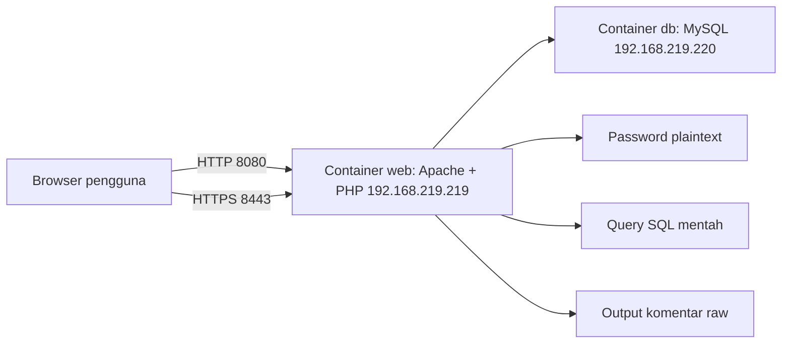

# Dokumentasi Aplikasi CLO 2 Non-Secure Comments

## 1. Pendahuluan

Secure Comments pada branch ini adalah skenario non-secure untuk menunjukkan kondisi aplikasi sebelum pengamanan diterapkan. Aplikasi dibuat dengan PHP, Apache, MySQL, dan Docker Compose. Pengguna publik dapat membaca komentar, pengguna terdaftar dapat menulis komentar, dan admin panel dipakai untuk melihat data yang tersimpan.

Kontrol keamanan yang sengaja dimatikan:

- Password disimpan plaintext tanpa hash dan salt.
- Login memakai query SQL mentah.
- Token CSRF tidak divalidasi.
- Output komentar tidak di-escape.
- Komentar tidak dibatasi 500 karakter.
- Cookie session tidak memakai konfigurasi hardening.
- HTTP tidak diarahkan otomatis ke HTTPS.

## 2. Arsitektur dan Instalasi

Komponen utama:

- `web`: container PHP 8.3 + Apache.
- `db`: container MySQL 8.4.
- Nama: `Andrian Irmawan`.
- NIM: `101032300219`.
- Container web: `andrian_irmawan_101032300219_web`.
- Container database: `andrian_irmawan_101032300219_db`.
- Network Docker: `192.168.219.0/24`.
- IP container web: `192.168.219.219`.
- IP container database: `192.168.219.220`.

IP web memakai oktet terakhir `219`, sesuai 3 digit akhir NIM. IP database memakai `.220` karena IP `.219` sudah dipakai container web.

Cara menjalankan:

```powershell
docker compose up --build -d
```

Jika Docker Desktop belum aktif:

```powershell
.\scripts\start-site.ps1
```

URL demo:

- HTTPS: `https://localhost:8443`
- HTTP: `http://localhost:8080`

Browser akan menampilkan peringatan jika membuka HTTPS karena sertifikat dibuat sendiri.

## 3. Blok Diagram



## 4. Fitur Aplikasi

- Halaman utama `/` menampilkan komentar publik.
- `/signup.php` untuk pendaftaran user biasa.
- `/login.php` untuk autentikasi.
- `/comment.php` untuk menulis komentar setelah login.
- `/admin.php` menampilkan data pengguna, komentar, dan password plaintext.
- `/logout.php` untuk keluar dari sesi.

Akun demo:

- Username: `admin`
- Password: `Admin@240!`

## 5. Kondisi Non-Secure

### Password Plaintext

Password admin dan user disimpan langsung di kolom `password_hash`, tetapi isinya plaintext. Admin panel menampilkan nilai tersebut agar mudah dibuktikan.

Contoh nilai admin:

```text
Admin@240!
```

### Login Raw SQL

Login membaca input username/password dan menyusun SQL secara langsung tanpa prepared statement. Payload seperti berikut dapat melewati autentikasi:

```text
' OR '1'='1
```

### XSS dan CSRF

Output komentar dirender apa adanya tanpa `htmlspecialchars()`. Token CSRF juga tidak dibuat dan tidak diperiksa, sehingga POST tanpa token tetap diterima.

### Input Berlebihan

Komentar memakai tipe `TEXT` dan tidak dibatasi 500 karakter di server maupun client. Apache juga tidak memakai `LimitRequestBody` khusus pada branch ini.

## 6. Skenario Uji

| No | Skenario | Hasil yang diharapkan |
| --- | --- | --- |
| 1 | Buka `/` tanpa login | Komentar publik tampil |
| 2 | Login payload `' OR '1'='1` | Masuk sebagai admin |
| 3 | Signup user baru | User bisa dibuat dan login |
| 4 | User biasa buka `/admin.php` | Panel tetap terbuka |
| 5 | Admin buka `/admin.php` | Password plaintext tampil |
| 6 | Komentar payload `<script>alert(1)</script>` | Script dieksekusi browser |
| 7 | Komentar lebih dari 500 karakter | Tetap tersimpan |
| 8 | POST tanpa CSRF token | Tetap diterima |

## 7. Kesimpulan

Branch ini menunjukkan kondisi non-secure: password belum di-hash, query login rentan SQL injection, komentar raw rentan XSS, CSRF tidak aktif, pembatasan input tidak aktif, dan admin panel tidak dibatasi role. Bandingkan dengan branch `secure-login` untuk versi yang sudah diamankan.

## 8. Catatan Penggunaan AI

Bantuan AI digunakan untuk menyusun dan mengimplementasikan aplikasi, dokumentasi, naskah video, dan presentasi berdasarkan instruksi tugas serta README. Jika aturan kelas membatasi AI hanya untuk editing, mahasiswa perlu menyesuaikan dokumen akhir dengan versi asli/manual yang dimiliki dan melampirkan versi asli sebelum diedit AI.
