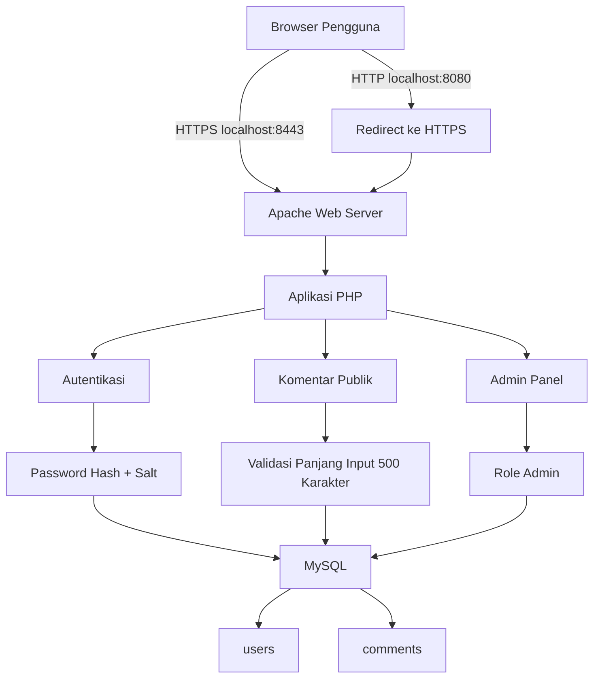

```mermaid
flowchart TD
    A["Browser Pengguna"] -->|HTTP localhost:8080| B["Redirect ke HTTPS"]
    A -->|HTTPS localhost:8443| C["Apache Web Server"]

    B --> C
    C --> D["Aplikasi PHP"]

    D --> E["Autentikasi"]
    D --> F["Komentar Publik"]
    D --> G["Admin Panel"]

    E --> H["Password Hash + Salt"]
    F --> I["Validasi Panjang Input 500 Karakter"]
    G --> J["Role Admin"]

    H --> K["MySQL"]
    I --> K
    J --> K

    K --> L["users"]
    K --> M["comments"]

```
